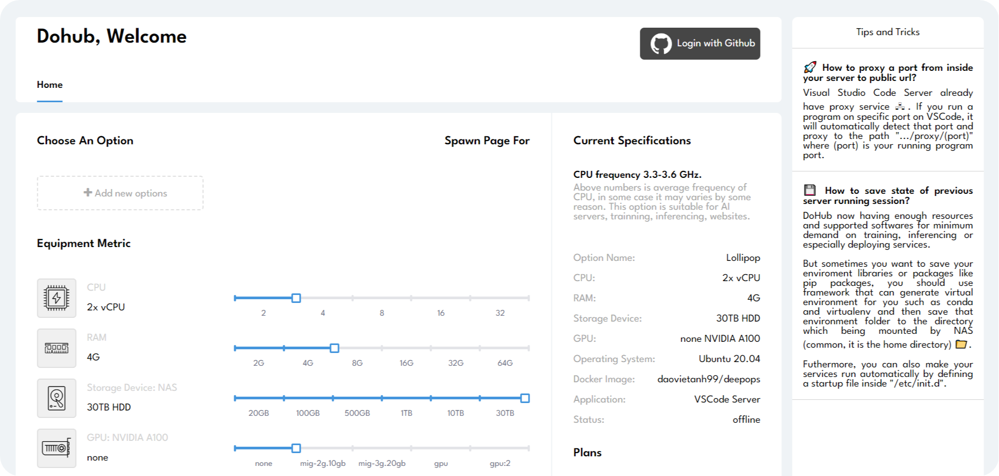

# DeepOpsHub

[](https://github.com/daovietanh190499/DeepOps/discussions) [](https://dohub-workspace.slack.com/archives/C055MQTL258) [](https://twitter.com/daovietanh99) [](https://github.com/daovietanh190499/DeepOps)

Run [DeepOps Hub](https://github.com/daovietanh190499/DeepOps) on any cluster, system anywhere and
access it in the browser.



## Highlights

- Code on any device with a consistent development environment
- Use cloud servers to speed up tests, compilations, downloads, and more
- Make things more automatic

## Requirements

See [requirements](https://github.com.daovietanh190499/DeepOps) for minimum specs, as well as instructions
on how to set up a Google VM on which you can install code-server.

**TL;DR:** Linux machine with WebSockets enabled, 1 GB RAM, and 2 vCPUs

To run on machine that have K8s and helm installed
```shell
bash run.sh
```