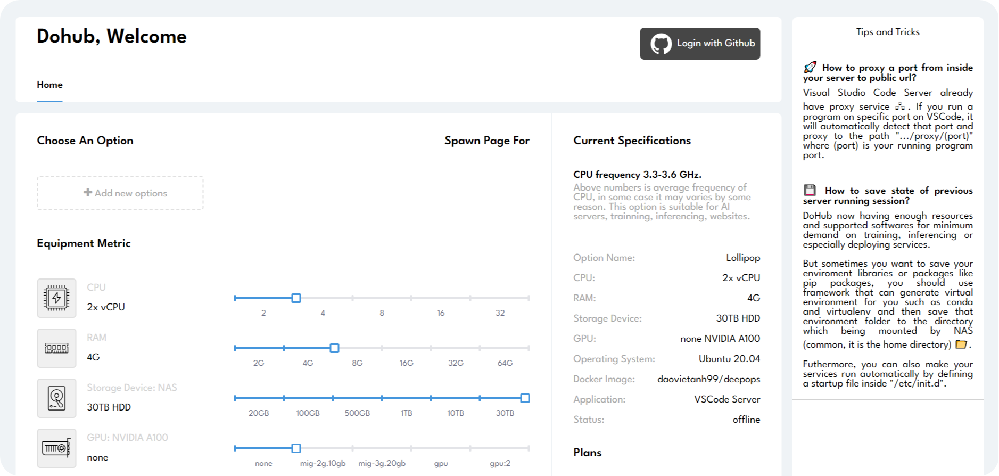

# DeepOps Hub

Nền tảng hub quản lý và spawn **code-server** trên Kubernetes, với đăng nhập GitHub và giao diện web.



## Highlights

- Code trên trình duyệt với môi trường thống nhất
- Spawn workspace theo cấu hình CPU/RAM/GPU qua Helm
- Quản trị user/server từ trang Admin

## Kiến trúc mới

- **Backend:** Django (`DeepOpsBackend/`)
- **Chart hệ thống:** `dohub/` (ở root repo)
- **Chart workspace user:** `charts/codehub/`
- **Chart Jenkins (CI/CD):** `charts/jenkins/` — xem [charts/jenkins/README.md](./charts/jenkins/README.md)

## Triển khai nhanh

Xem chi tiết trong [DEPLOY.md](./DEPLOY.md).

```bash
cp dohub/secrets/.env.example dohub/secrets/.env
# chỉnh .env và dohub/configmap/config.yaml

chmod +x build-and-deploy.sh
./build-and-deploy.sh all          # hoặc: ./build-and-deploy.sh -r myreg/dohub -t 1.0.0 -p all
```

## Jenkins (tuỳ chọn)

```bash
JENKINS_ADMIN_PASSWORD='your-password' ./deploy-jenkins.sh install
```

## Requirements

- Linux, WebSockets (ingress nginx)
- Cluster K8s + Helm 3 + DirectPV (`directpv-min-io`)
- ~1 GB RAM cho hub pod (khuyến nghị)
